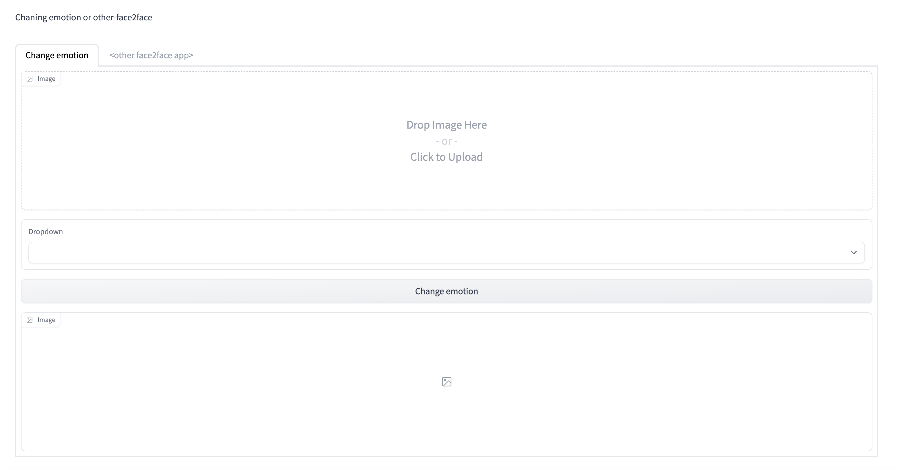

## MEME Manipulation App

Check out the configuration reference at https://huggingface.co/docs/hub/spaces-config-reference

## Instructions

1. run `pip install -r requirements.txt`
2. run `python app.py`
## UI

